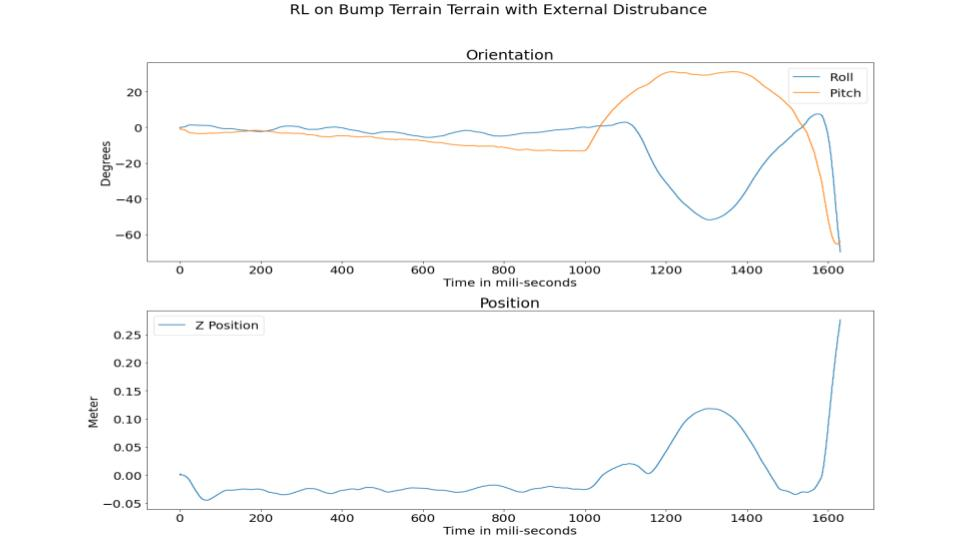

# TRISC: A Bipedal Legged Wheel Robot (RL for Ascento)
Source code for a reinforcement learning based controller for legged wheel robot. 

## Aim
<ol>
  <li>To develop a robotic platform whose performance and efficiency is not limited due to the presence of unstructured environments like stairs, humps, obstacles etc.</li>
  <li>Design a robot which is capable of leveraging advantages of both legs and wheels</li>
  <li>Develop a controller based on classical control theory to operate and stabilize the robot</li>
  <li>Program and train a reinforcement learning agent to control the robot without any dynamical model of the system</li>
  <li>Compare the performance of both the controllers in various environments and conditions</li>
</ol>

## Robot Design 

## Controllers
### 1. PID

### 2. Reinforcement Learning
<ul>
  <li>State_Space = [Error_in_X, Error_in_Y, Error_in_Z, Roll, Pitch, Yaw, Velocity_in_X, Velocity_in_Y, Velocity_in_Z, Velocity_in_Roll, Velocity_in_Pitch, Velocity_in_Yaw]</li>
  <li>Action_Space = [left_hip_cmd, right_hip_cmd, left_wheel_cmd, right_wheel_cmd]<li>
  <li>
    Reward = Alive_Bonus - Reference_Velocity_Penalty - Straight_Line_Motion_Penalty -Balancing_Penalty - Hip_Actuation_Penalty - Wheel_Actuation_Penalty 
    <ul>
      <li>Reference_Velocity_Penalty : 3*(ref - self.v)**2</li>
      <li>Straight_Line_Motion_Penalty : 10*(self.y)**2</li>
      <li>Balancing_Penalty : 50*(self.body_angle)**2</li>
      <li>Hip_Actuation_Penalty : 0.01*(self.left_wheel_cmd**2 + self.right_wheel_cmd**2)</li>
      <li>Wheel_Actuation_Penalty : 0.01*(self.left_hip_cmd**2 + self.right_hip_cmd**2)</li>
      <li>Alive_Bonus: 25</li>
    </ul>
  </li>
</ul>

## Results
### 1. PID
#### a. Flat Terrain

  
#### b. On Ramp with Both Legs

#### c. On Ramp with One Leg

  
#### d. On Speed Hump

### 2. Reinforcement Learning
#### a. Flat Terrain

  
#### b. On Ramp with Both Legs

#### c. On Ramp with One Leg

  
#### d. On Speed Hump

